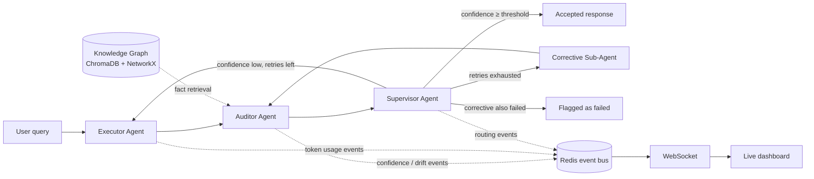

# NeoCortex Orchestrator

**A self-healing multi-agent LLM framework.** A 3-tier agent hierarchy
(Executor → Auditor → Supervisor) that audits its own outputs for factual
consistency and semantic drift, and automatically retries or escalates to a
corrective sub-agent when confidence drops — instead of silently returning
a possibly-hallucinated answer.

Built with **LangGraph** (agent orchestration), **FastAPI + WebSocket**
(API and live observability dashboard), **GPT-4** (pluggable LLM backend),
**ChromaDB** (ground-truth fact retrieval), and **Redis** (event bus /
session state).

## Architecture



- **Executor Agent** — produces the answer. On a retry, it receives the
  Supervisor's feedback as additional context.
- **Auditor Agent** — retrieves relevant facts from the knowledge graph and
  scores the Executor's response on two axes: an NLI entailment score
  (does the response follow from the retrieved facts?) and a semantic
  drift score (cosine distance between the response's embedding and the
  nearest facts / the previous accepted response). These combine into a
  single confidence score.
- **Supervisor Agent** — pure routing logic: accept, send back to the
  Executor with concrete feedback, escalate to a stricter **corrective
  sub-agent** once ordinary retries are exhausted, or give up and flag the
  session as failed.
- **Knowledge graph** — a small NetworkX relation graph layered over a
  ChromaDB vector index, so retrieval is genuinely backed by a vector DB
  while still supporting explicit subject→relation→object traversal.
- **Observability dashboard** — every node publishes an event to Redis as
  it runs; a FastAPI WebSocket endpoint fans those events out live to the
  dashboard at `/dashboard` (call graph, confidence/drift over time, token
  counts, anomaly flags).

## Project layout

```
src/neocortex/
  config.py              settings (env-driven)
  embeddings.py           shared embedding provider (+ offline hashed fallback)
  llm/client.py            GPT-4 client + offline MockLLMClient
  nli/consistency.py       NLI factual-consistency scorer (+ lexical fallback)
  memory/knowledge_graph.py  ChromaDB + NetworkX fact store
  memory/redis_bus.py       Redis pub/sub event bus + session state
  drift/semantic_drift.py   cosine-similarity drift detection
  agents/executor.py        Executor + corrective sub-agent
  agents/auditor.py         Auditor agent
  agents/supervisor.py      Supervisor routing logic
  graph/state.py            shared LangGraph state schema
  graph/orchestrator.py      LangGraph wiring + observability hooks
  api/main.py               FastAPI app
  api/dashboard/index.html   live dashboard (WebSocket client)
tests/                     pytest suite
benchmarks/                 reproducible benchmark harness (see below)
examples/                  quickstart + knowledge-base seeding scripts
```

## Getting started

```bash
git clone <your-repo-url>
cd neocortex-orchestrator
python -m venv .venv && source .venv/bin/activate
pip install -r requirements.txt
cp .env.example .env
```

The repo runs **fully offline with no API key** by default
(`USE_MOCK_LLM=true` in `.env.example`): a deterministic mock LLM stands
in for GPT-4, and the embedding/NLI models fall back to lightweight
dependency-free heuristics if their weights can't be downloaded. This is
enough to exercise the whole graph, the dashboard, and the test suite. For
real results, install the actual models (just requires
`sentence-transformers` and network access to download weights once) and
set `USE_MOCK_LLM=false` with a real `OPENAI_API_KEY`.

Run Redis (needed for the live dashboard; the app degrades gracefully to a
no-op event bus without it):

```bash
docker run -d --rm --name neocortex-redis -p 6379:6379 redis:7-alpine
```

Seed the knowledge graph with a few starter facts, then start the API:

```bash
python examples/seed_knowledge_base.py
PYTHONPATH=src uvicorn neocortex.api.main:app --reload
```

Or use the bundled dev script (`./scripts/dev.sh`), or `docker compose up`
to run the API + Redis together.

Open `http://localhost:8000/dashboard` for the live observability view,
and run a query:

```bash
curl -X POST http://localhost:8000/api/sessions \
  -H "Content-Type: application/json" \
  -d '{"query": "When was the Eiffel Tower completed?"}'
```

## Library usage (no API layer)

```bash
python examples/quickstart.py
```

See `examples/quickstart.py` for wiring the agents directly into another
application.

## Tests

```bash
pip install pytest
PYTHONPATH=src pytest -q
```

The test suite (`tests/`) covers the drift-detection math, the
Supervisor's routing decisions (accept / retry / escalate / fail), and the
FastAPI endpoints — all running against the offline mock LLM, so it needs
no API key or external services.

## Benchmarks — and an honest note on numbers

`benchmarks/run_benchmark.py` is a reproducible harness that measures, on
**your machine**, against `benchmarks/eval_set.json`:

- hallucination rate, baseline single-pass executor vs. the full
  self-correction loop (scored via the same NLI model used in production —
  this is a proxy metric against a small hand-written fact set, not an
  independently labeled benchmark, and the script's output says so);
- mean/p95 latency per session;
- throughput under N concurrent simulated sessions.

```bash
python benchmarks/run_benchmark.py --concurrency 100
```

**Use this to generate your own numbers rather than reusing anyone else's.**
Results depend heavily on which LLM backend, NLI model, and eval set you
run against — a number quoted without the harness that produced it isn't
verifiable. Re-run it, look at `benchmarks/results.json`, and quote what
you actually measured.

## Known limitations / things worth checking before relying on this

- **LangGraph's API moves fast.** This was written against the
  `StateGraph` / `add_conditional_edges` / `END` API common in 2024–2025
  releases. If `graph.compile()` errors after a library upgrade, check the
  current LangGraph docs — this is the most likely spot to need a small
  adjustment.
- **NLI label order.** `cross-encoder/nli-deberta-v3-base` is assumed to
  output `[contradiction, entailment, neutral]` logits per its model card.
  Swapping in a different checkpoint without verifying its label order is
  the classic way to silently invert every confidence score.
- **Offline fallbacks are intentionally weak.** The hashed-embedding and
  lexical-overlap fallbacks exist so the repo runs with zero external
  downloads, not because they're a good substitute for real
  sentence-transformer / NLI models. Expect noticeably better (and
  noticeably more expensive to fake) results once real model weights are
  loaded.

## License

MIT — see `LICENSE`.
